<!--
  Animated profile assets:
  - Contribution graph: python scripts/fetch_contributions.py && python scripts/render_heatmap_svg.py
  - Portrait: python scripts/prep_photo.py && python scripts/make_ascii_svg.py
  - Info panel: python scripts/make_info_card.py
-->

<h3><code>rahma@github ~ $ ./contributions.sh</code></h3>

 
 

<h3><code>rahma@github ~ $ whoami</code></h3>

<table>
<tr>
<td valign="top"></td>
<td valign="top"></td>
</tr>
</table>

 
 

<h3><code>rahma@github ~ $ ./links.sh</code></h3>

<b>UI/UX Designer · Full-Stack Developer · Creative Graphic Designer</b>

 

